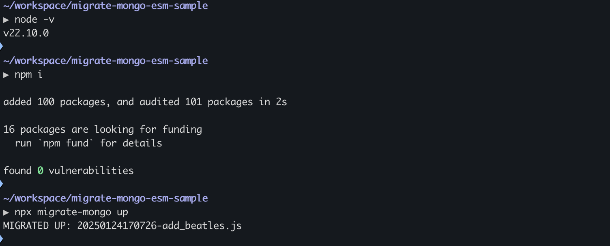

# Migrate-Mongo ESM Issue Using Node 22.13

This sample project demonstrates an error with [migrate-mongo](https://www.npmjs.com/package/migrate-mongo) when using Node 22.13 with ESM.

Error occurs when attempting to apply migrations via `migrate-mongo up` command.


Using node version 22.10, migration works as expected.



## Reproduction steps:

1. Run local instance of mongodb using provided [docker-compose.yaml](./docker-compose.yml)
```bash
docker compose up -d
```

2. Install node LTS version 22.13 (this example uses [n](https://www.npmjs.com/package/n))

```bash
npm i n -g
n 22.13
```

3. Attempt to apply migrations

```bash
npm i
npx migrate-mongo up
```